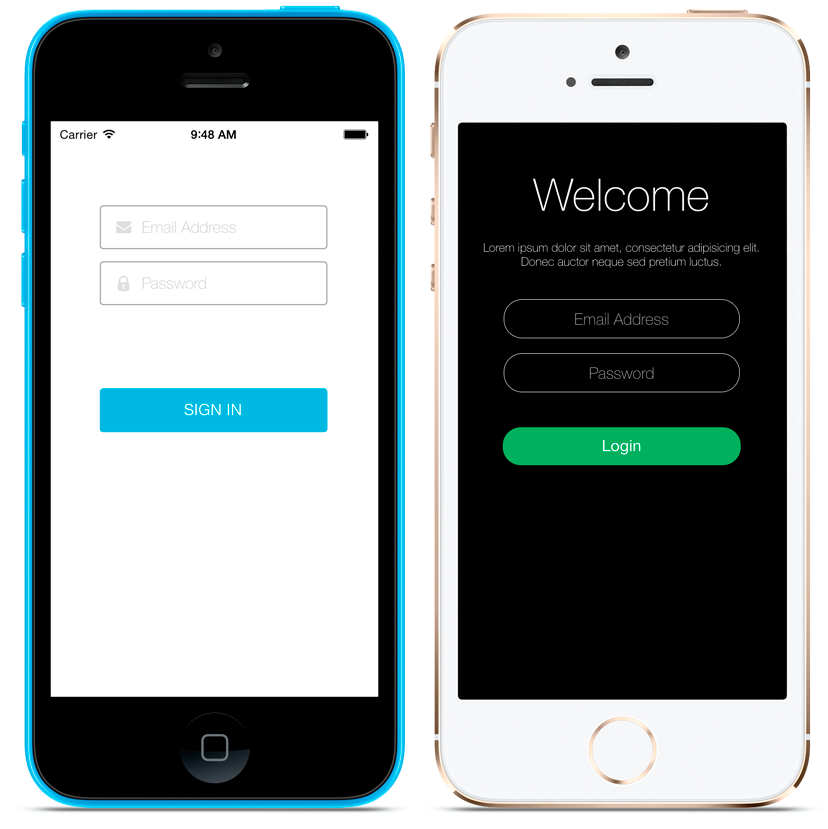
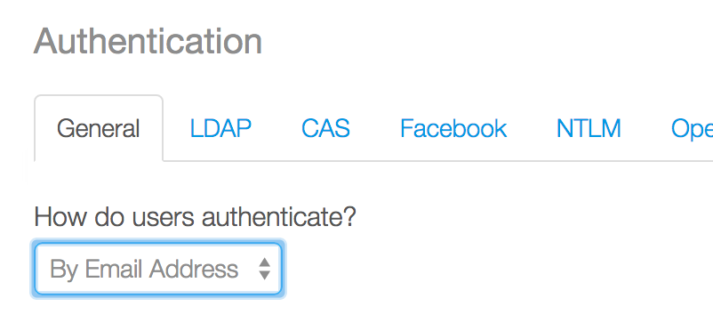

# LoginWidget for iOS (Auth module)

## Important note
__This product is under heavy development and most of the features aren't ready to be used in production.
It's public just in order to allow developers to preview the technology.__

## Features
- Authenticate users against Liferay Portal user management.
- Three different authentication methods are supported:
	- Email address
	- Screen name
	- User id
- When user is succesfully authenticated, her attributes are retrieved in order to be used by the programmer.
- User credentials and attributes can be stored securely in the keychain.
- Stored credentials and attributes can be used to perform auto login operations on next start ups.

## Supported in themes

- Default
- Flat7

## Requirements

- XCode 6.0 or above
- iOS 8 SDK
- Liferay Portal 6.2 CE or EE

## Compatiblity

- iOS 7 and above

## Server configuration
The right authentication method should be configured in `Control Panel - Portal Settings - Authentication`

Refer to [Configuring Portal Settings](https://www.liferay.com/documentation/liferay-portal/6.2/user-guide/-/ai/portal-settings-liferay-portal-6-2-user-guide-16-en) section for more details.

## Attributes

| Attribute | Data type | Explanation |
|-----------|-----------|-------------| 
|  `saveCredentials` | `boolean` | When set, stores the user credentials and attributes to keychain. In next runs, you can load stored credentials calling `SessionContext.loadSessionFromStore()` |
|  `companyId` | `number` | When set, the authentication is done for a user within the especified company. If the value is 0, the company especified in `LiferayServerContext` will be used. |
|  `authMethod` | `string` | The authentication method configured in the server. One of the following values: `email`, `screenName` or `userId` |

## Delegate

LoginWidget delegates some event in an object that conforms `LoginWidgetDelegate` protocol.
This protocol allows to implement the following methods:

- `onLoginResponse(dictionary)`: called when login is successfully completed. The user attributes are passed as a dictionary of keys (NSStrings) and values (NSObject). Keys supported are the same as [portal's User entity](https://github.com/liferay/liferay-portal/blob/6.2.x/portal-impl/src/com/liferay/portal/service.xml#L2227)
- `onLoginError(error)`: called when an error happened in the login. The NSError object describing the login error occurred.
- `onCredentialsSaved`: called when the user credentials are successfully stored (after a successfull log in).
- `onCredentialsLoaded`: called when the user credentials are retrieved (if the widget is used and stored credentials are available).

    
    
