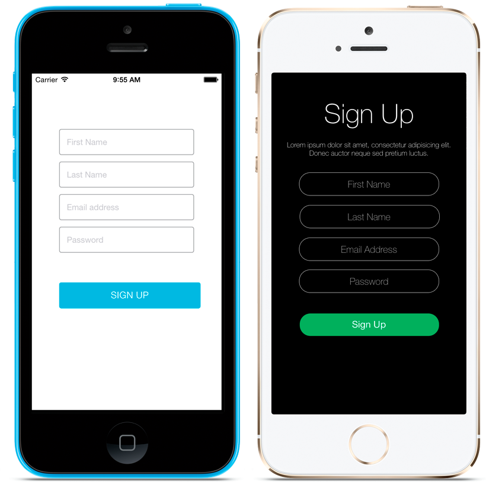

# SignUpWidget for iOS (Auth module)

## Important note
__This product is under heavy development and most of the features aren't ready to be used in production.
It's public just in order to allow developers to preview the technology.__

## Features
- Creates a new user in the portal.
- Could make a auto login if the creation is successful.
- Could save the credentials of the user created in the keychain.

## Supported in themes

- Default
- Flat7

## Requirements

- XCode 6.0 or above
- iOS 8 SDK
- Liferay Portal 6.2 CE or EE

## Compatiblity

- iOS 7 and above

## Server configuration

The configuration related to this widget can be found at `Control Panel - Portal Settings - Authentication`

Refer to [Configuring Portal Settings](https://www.liferay.com/documentation/liferay-portal/6.2/user-guide/-/ai/portal-settings-liferay-portal-6-2-user-guide-16-en) section for more details.

### Anonymous request
Given that this request is done without being logged in, it need to be authenticated against the API. It's recommended that the portal administrator creates an specific user with minimal permissions in order to allow this operation.

## Attributes

| Attribute | Data type | Explanation |
|-----------|-----------|-------------| 
|  `anonymousApiUserName` | `string` | The user name, email adress, or userId (depending on portal's authentication method) to use for authenticate this request. |
|  `anoymousApiPassword` | `string` | The password to be used to authenticate this request. |
|  `companyId` | `number` | When set, the authentication is done for a user within the especified company. If the value is 0, the company especified in `LiferayServerContext` will be used. |
|  `autologin` | `boolean` | Whether or not the user will be logged in after sucessful sign up. |
|  `saveCredentials` | `boolean` | Whether or not the user credentials and attributes will be stored in the keychain after a sucessful log in. It's ignored if `autologin` is disabled. |

## Delegate

This widget will delegate some event in an object that conforms `SignUpWidgetDelegate` protocol.
If the `autologin` is enabled, login events will be delegated to an object conforming `LoginWidgetDelegate`. Refer to [LoginWidget documentation](LoginWidget.md) for more details on this.

The `SignUpWidgetDelegate` protocol allows to implement the following methods:

- `onSignUpResponse(boolean)`: called when sign up is successfully completed. The user attributes are passed as a dictionary of keys (NSStrings) and values (NSObject). Keys supported are the same as [portal's User entity](https://github.com/liferay/liferay-portal/blob/6.2.x/portal-impl/src/com/liferay/portal/service.xml#L2227)
- `onSignUpError(error)`: called when an error happened in the process. The NSError object describing the error occurred.

    
    
